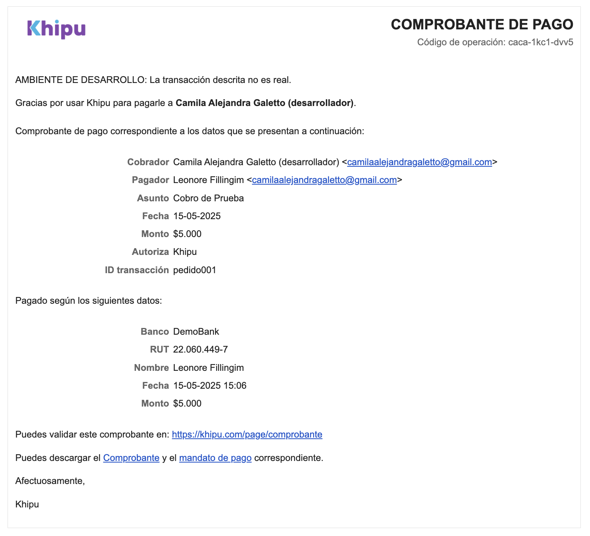

# 💸 Integración de pagos con la API de Khipu

Este proyecto fue desarrollado como parte del proceso de selección para el 
equipo de Khipu.

El objetivo principal fue simular un flujo real de cobro utilizando 
exclusivamente la **API REST v3 de Khipu** en entorno de pruebas 
(**Demobank**), sin intervención manual desde el portal.

Toda la integración fue realizada mediante código utilizando **Python y 
Flask**, generando el cobro a través de una llamada `POST` a 
`/v3/payments` con los datos requeridos. El flujo incluye redirección al 
entorno de pago, confirmación del resultado, y mensajes finales.

✅ Se utilizaron recursos de documentación oficial y herramientas de apoyo 
(como IA), pero toda la implementación fue desarrollada y probada de forma 
autónoma.

---

## 🛠 Tecnologías utilizadas

- Python 3.13  
- Flask  
- requests  
- HTML5 / Markdown  
- Git / GitHub

---
## 📸 Proceso paso a paso de la integración con Khipu

<ul>
  <li>
    <strong>🟣 Paso 1: Inicio del flujo</strong><br>
    El usuario accede a la aplicación y ve el botón “Pagar con Khipu”.<br>
    
  </li>
  <li>
    <strong>🟣 Paso 2: Detalle del pago</strong><br>
    Pantalla donde se muestra el monto total a pagar y se inicia la operación.<br>
    
  </li>
  <li>
    <strong>🟣 Paso 3: Selección del banco</strong><br>
    El usuario elige su banco desde la interfaz de Khipu.<br>
    
  </li>
  <li>
    <strong>🟣 Paso 4: Ingreso de credenciales</strong><br>
    Se simula el inicio de sesión en DemoBank con usuario y clave.<br>
    
  </li>
  <li>
    <strong>🟣 Paso 5: Autorización del pago</strong><br>
    Validación mediante clave dinámica para autorizar la operación.<br>
    
  </li>
  <li>
    <strong>🟣 Paso 6: Confirmación visual</strong><br>
    Pantalla que indica que la transferencia fue exitosa.<br>
    
  </li>
  <li>
    <strong>🟣 Paso 7: Comprobante de pago</strong><br>
    Comprobante enviado por email al finalizar la operación.<br>
    
  </li>
</ul>

---

## ▶️ Cómo ejecutar el proyecto

```bash
# 1. Cloná el repositorio:
git clone https://github.com/camigaletto/Khipu-Integracion.git
cd Khipu-Integracion

# 2. Activá el entorno virtual:
source env/bin/activate

# 3. Instalá las dependencias:
pip install flask requests

# 4. Ejecutá la aplicación:
python app.py

# 5. Accedé desde tu navegador:
http://localhost:5000
