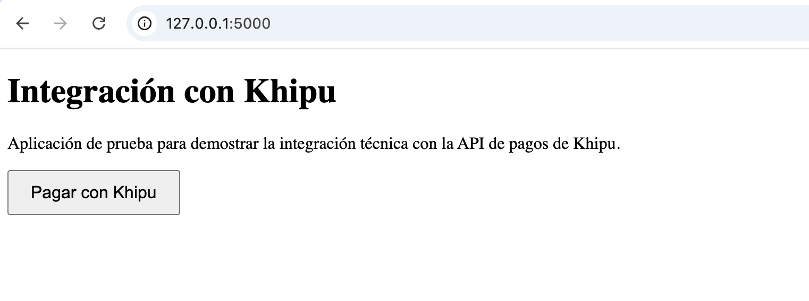
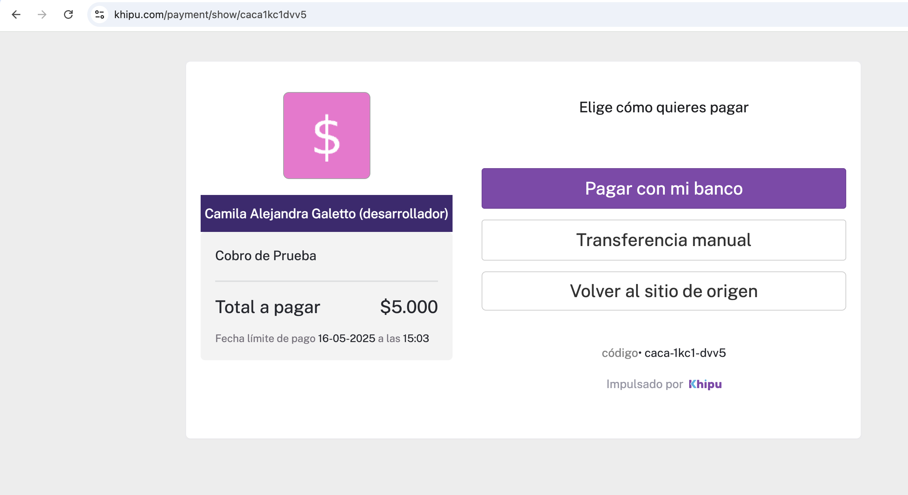
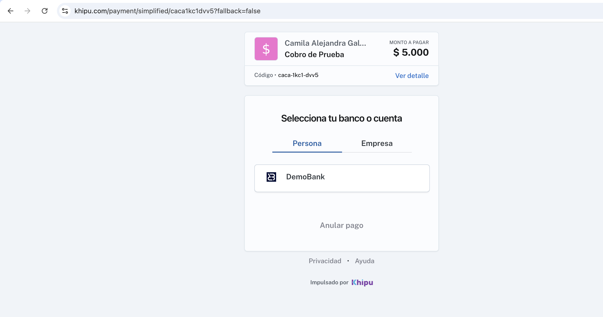
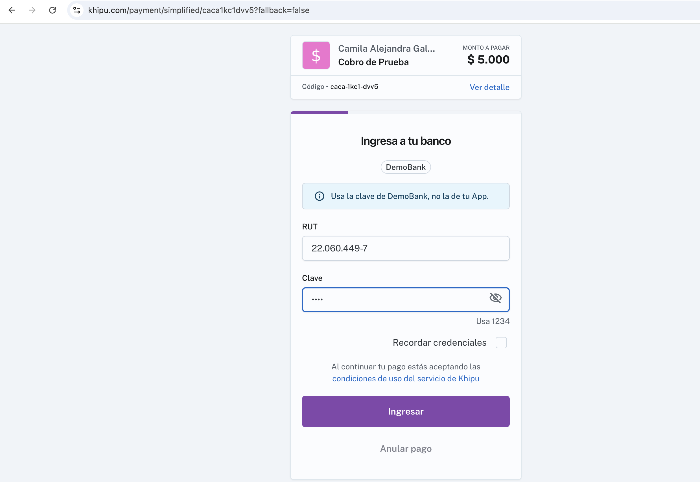
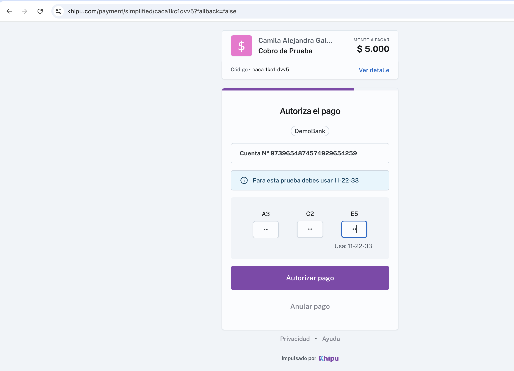
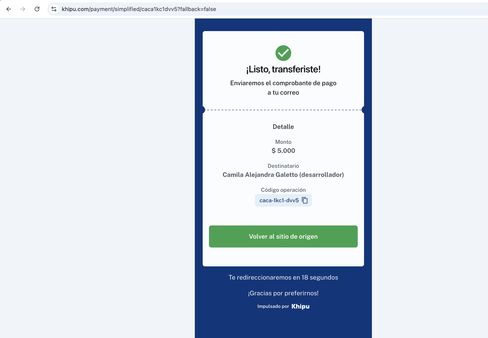

# 💸 Integración de pagos con la API de Khipu

Este proyecto fue desarrollado como parte del proceso de selección para el 
equipo de Khipu.

El objetivo principal fue simular un flujo real de cobro utilizando 
exclusivamente la **API REST v3 de Khipu** en entorno de pruebas 
(**Demobank**), sin intervención manual desde el portal.

Toda la integración fue realizada mediante código utilizando **Python y 
Flask**, generando el cobro a través de una llamada `POST` a 
`/v3/payments` con los datos requeridos. El flujo incluye redirección al 
entorno de pago, confirmación del resultado, y mensajes finales.

✅ Se utilizaron recursos de documentación oficial y herramientas de apoyo 
(como IA), pero toda la implementación fue desarrollada y probada de forma 
autónoma.

---

## 🛠 Tecnologías utilizadas

- Python 3.13  
- Flask  
- requests  
- HTML5 / Markdown  
- Git / GitHub

---

## ▶️ Cómo ejecutar el proyecto

```bash
# 1. Cloná el repositorio:
git clone https://github.com/camigaletto/Khipu-Integracion.git
cd Khipu-Integracion

# 2. Activá el entorno virtual:
source env/bin/activate

# 3. Instalá las dependencias:
pip install flask requests

# 4. Ejecutá la aplicación:
python app.py

# 5. Accedé desde tu navegador:
http://localhost:5000

---

## 📸 Capturas del proceso de integración

### 🖥️ Paso 1: Vista inicial de la aplicación Flask
> El usuario accede a la ruta `/` y se renderiza `index.html` con el botón 
para iniciar el flujo de pago.  
[](static/img/paso1khipu.png)

---

### 💳 Paso 2: Generación del link de pago desde Flask
> Al hacer clic en el botón, se hace una solicitud `GET /pagar`, que 
ejecuta una llamada `POST` desde `app.py` a  
> 
[`https://payment-api.khipu.com/v3/payments`](https://payment-api.khipu.com/v3/payments).  
[](static/img/paso2khipu.png)

---

### 🏦 Paso 3: Selección de cuenta Demobank
> Khipu redirige al usuario al entorno de pruebas, donde selecciona su 
banco (DemoBank) para continuar con el pago.  
[](static/img/paso3khipu.png)

---

### 🔐 Paso 4: Ingreso a DemoBank
> El usuario ingresa su RUT y clave. Para efectos de test, Khipu provee 
credenciales simuladas.  
[](static/img/paso4khipu.png)

---

### 📲 Paso 5: Autorización del pago
> Se utiliza el token de validación (clave dinámica) provisto para 
confirmar la operación.  
[](static/img/paso5khipu.png)

---

### ✅ Paso 6: Confirmación de pago
> Una vez completado, Khipu muestra la pantalla de éxito y redirige 
automáticamente a `/success`.  
[](static/img/paso6khipu.png)


